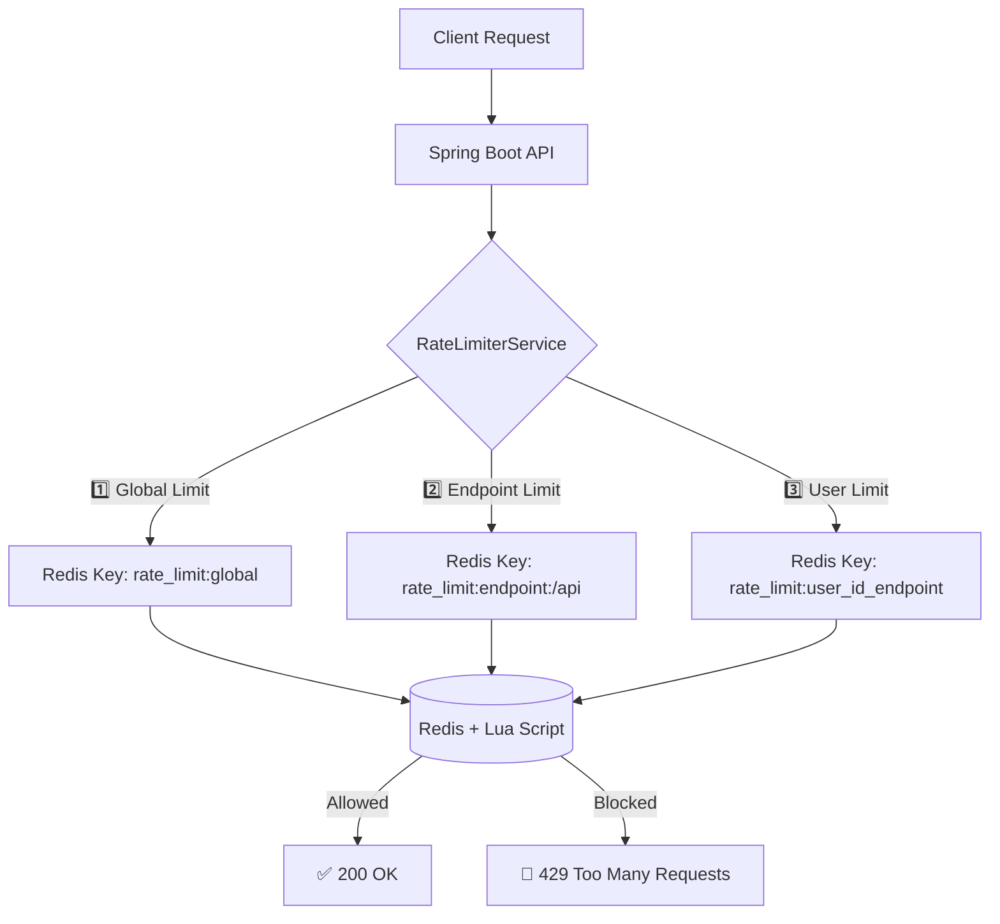

# 🚀 Distributed Rate Limiter (Spring Boot + Redis + Lua)

A **production-grade, distributed rate limiter** built using **Spring Boot**, **Redis**, and **Lua scripting**.  
It supports **global**, **per-user**, and **per-endpoint** rate limits with atomic operations, ensuring accuracy and consistency in distributed environments.

---

## ⚙️ Features

✅ Atomic Rate Limiting (Redis + Lua)  
✅ Multi-level limits (Global / Endpoint / User)  
✅ Dynamic configuration via Admin API  
✅ Prometheus metrics support  
✅ Docker-ready (Redis container)  
✅ Extensible for API gateways and microservices

---

## 🧠 Architecture Overview



## 🧩 Tech Stack
| Layer | Technology |
|--------|-------------|
| Backend | Spring Boot 3.5 |
| Language | Java 17 |
| Cache / Storage | Redis |
| Scripting | Lua |
| Monitoring | Micrometer + Prometheus |
| Containerization | Docker |
| Build Tool | Maven |

## 🛠️ Setup & Run

### 1️⃣ Clone the Repository
```bash
git clone https://github.com/sanjaykumars-dev/distributed-rate-limiter.git
cd distributed-rate-limiter
```

### 2️⃣ Start Redis (via Docker)
```bash 
docker run -d --name redis -p 6379:6379 redis
```

### 3️⃣ Run the Application
```bash
mvn spring-boot:run
```

### 4️⃣ Verify the Application
Test endpoint limit:
```bash
curl "http://localhost:8081/api/limit?userId=sanjay&endpoint=/login"
```
Update configuration dynamically:
```bash
curl -X POST "http://localhost:8081/api/admin/ratelimiter/update?type=endpoint&name=/login&window=60&limit=3"
```

✅ Expected behavior
* Allowed → HTTP 200 OK
* Blocked → HTTP 429 Too Many Requests

## 🧪 Usage Examples

### Check Request Limit

```bash
curl "http://localhost:8081/api/limit?userId=sanjay&endpoint=/login"
```

### Update Global Config
```bash
curl -X POST "http://localhost:8081/api/admin/ratelimiter/update?type=global&window=120&limit=10000"
```

### Update Endpoint Config
```bash
curl -X POST "http://localhost:8081/api/admin/ratelimiter/update?type=endpoint&name=/data&window=60&limit=10"
```

## 📁 Project Structure
```bash
src/main/java/com/sanjay/ratelimiter
 ├── controller/
 │    ├── LimitController.java              # Handles user rate limit requests
 │    └── RateLimiterConfigController.java  # Admin endpoint for dynamic updates
 ├── service/
 │    └── RateLimiterService.java           # Core Redis + Lua logic
 ├── util/
 │    └── RateLimiterProperties.java        # Maps rate-limit YAML configurations
 ├── script/
 │    └── RateLimiterScript.lua             # Atomic Redis Lua script
 └── DistributedRateLimiterApplication.java # Spring Boot main class
```

## 🧮 Lua Script Logic
Executed atomically inside Redis:
```lua
ARGV[1] = now
ARGV[2] = window
ARGV[3] = limit

-- Remove entries older than the time window
ZREMRANGEBYSCORE key -inf now-window

-- Count requests within window
local count = ZCARD key

-- If below limit, record the new request
if count < limit then
    ZADD key now now
    EXPIRE key window
    return 1  -- Allowed
else
    return 0  -- Blocked
end
```
✅ This ensures atomicity — no race conditions under high concurrency.

## 🔮 Future Enhancements
* Persist rate-limit configurations in Redis for restart safety
* Add Token Bucket / Leaky Bucket algorithms for burst handling
* Support Redis Cluster / Sentinel for high availability
* Provide full Docker Compose setup (App + Redis + Prometheus + Grafana)
* Integration with API Gateways (Kong / NGINX / Zuul)

## 👨‍💻 Author
Sanjay Kumar S

💼 Developer @ Zoho

📫 sanjaykumars.dev@gmail.com

🚀 Passionate about scalable backend systems and distributed architectures

## ⭐ Support
If you found this project helpful:
* ⭐ Star the repository on GitHub
* 🐞 Report issues or suggest improvements via Issues
* 💬 Share it with your network
* 🤝 Connect with me on [LinkedIn](https://www.linkedin.com/in/sanjay-kumar-s-968338194/)
